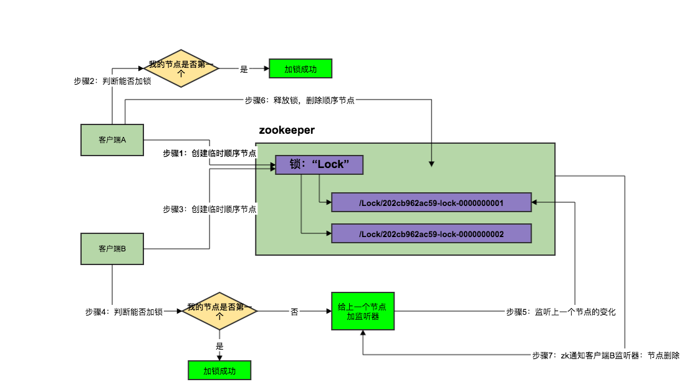

## 如何使用zookeeper实现分布式锁？


#### 在描述算法流程前，说下zookeeper关于节点的特性：

* 有序节点，当创建节点时zookeeperui根据节点数量自动添加整数序号，也就是说如果是第一个创建的子节点，那么生成的子节点为/lock/node-0000000000，下一个节点则为/lock/node-0000000001，依次类推。
* 临时节点：客户端可以建立一个临时节点，在会话结束或者会话超时后，zookeeper会自动删除该节点。
* 事件监听：在读取数据时，我们可以对节点设置事件监听，当节点数据或结构变化时，zookeeper会通知客户端


> zookeeper有四个事件：
>
> 1. 创建节点
> 2. 删除节点
> 3. 节点数据修改
> 4. 子节点变更


zookeeper的分布式锁算法流程如下：

1. 客户端连接zookeeper，并在/lock下创建**临时的**且**有序的**子节点，第一个客户端对应的子节点为/lock/lock-0000000000，第二个为/lock/lock-0000000001，以此类推。
2. 客户端获取/lock下的子节点列表，判断自己创建的子节点是否为当前子节点列表中**序号最小**的子节点，如果是则认为获得锁，否则**监听刚好在自己之前一位的子节点删除消息**，获得子节点变更通知后重复此步骤直至获得锁；
3. 执行业务代码；
4. 完成业务流程后，删除对应的子节点释放锁。




### 为什么用临时节点？

如果有客户端C、客户端D等N个客户端争抢一个zk分布式锁，原理都是类似的。

- 大家都是上来直接创建一个锁节点下的一个接一个的临时顺序节点
- 如果自己不是第一个节点，就对自己上一个节点加监听器
- 只要上一个节点释放锁，自己就排到前面去了，相当于是一个排队机制。

用临时顺序节点的用意就是，如果某个客户端创建临时顺序节点之后，不小心自己宕机了也没关系，zk感知到那个客户端宕机，会自动删除对应的临时顺序节点，相当于自动释放锁，或者是自动取消自己的排队。


### 具体如何去用？

```java
<dependency>
		<groupId>org.apache.curator</groupId>
		<artifactId>curator-recipes</artifactId>
		<version>4.0.0</version>
</dependency>
```


```java
import org.apache.curator.RetryPolicy;
import org.apache.curator.framework.CuratorFramework;
import org.apache.curator.framework.CuratorFrameworkFactory;
import org.apache.curator.framework.recipes.locks.InterProcessMutex;
import org.apache.curator.retry.ExponentialBackoffRetry;

public class DistributedLock {

    public static void main(String[] args) throws Exception {
        //创建zookeeper的客户端
        RetryPolicy retryPolicy = new ExponentialBackoffRetry(1000, 3);
        CuratorFramework client = CuratorFrameworkFactory.newClient("10.26.28.31:2181", retryPolicy);
        client.start();

        //创建分布式锁, 锁空间的根节点路径为/curator/lock
        InterProcessMutex mutex = new InterProcessMutex(client, "/curator/lock");
        mutex.acquire();
        //获得了锁, 进行业务流程
        System.out.println("Enter mutex");
        //完成业务流程, 释放锁
        mutex.release();

        //关闭客户端
        client.close();
    }
}
```


