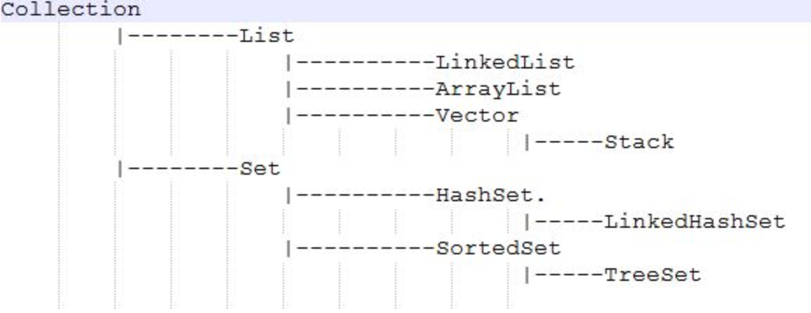

### ArrayList、Vector和LinkedList三个容易比较混淆，他们之间有啥具体的区别？CopyOnWriteArrayList又是什么？


首先都实现了List接口，可以看下图




* ArrayList是最常用的List实现类，内部是通过数组实现的，它允许对元素进行快速随机访问。数组的缺点是每个元素之间不能有间隔，当数组大小不满足时需要增加存储能力，就要讲已经有数组的数据复制到新的存储空间中。当从ArrayList的中间位置插入或者删除元素时，需要对数组进行复制、移动、代价比较高。因此，它适合随机查找和遍历，不适合插入和删除。`get()` 和`add()` 的时间复杂度都是O(1)，`remove()`是O(n)
* Vector与ArrayList一样，也是通过数组实现的，不同的是它支持线程的同步，即某一时刻只有一个线程能够写Vector，避免多线程同时写而引起的不一致性，但实现同步需要很高的花费，因此，访问它比访问ArrayList慢。
* LinkedList是用链表结构存储数据的，很适合数据的动态插入和删除，随机访问和遍历速度比较慢。另外，他还提供了List接口中没有定义的方法，专门用于操作表头和表尾元素，可以当作堆栈、队列和双向队列使用。
* CopyOnWriteList是一个写时复制的容器。当我们往一个容器添加元素的时候，不是直接往当前容器添加，而是先将当前容器进行copy一份，复制出一个新的容器，然后对新容器里面操作元素，最后将原容器的引用指向新的容器

### ArrayList

源码：
```java
    /**
     * Constructs a list containing the elements of the specified
     * collection, in the order they are returned by the collection's
     * iterator.
     *
     * @param c the collection whose elements are to be placed into this list
     * @throws NullPointerException if the specified collection is null
     */
    public ArrayList(Collection<? extends E> c) {
        elementData = c.toArray();
        if ((size = elementData.length) != 0) {
            // c.toArray might (incorrectly) not return Object[] (see 6260652)
            if (elementData.getClass() != Object[].class)
                elementData = Arrays.copyOf(elementData, size, Object[].class);
        } else {
            // replace with empty array.
            this.elementData = EMPTY_ELEMENTDATA;
        }
    }
```
Constructor根据参数大小创建数组，如果参数是0创建空数组

```java
    /**
     * Increases the capacity to ensure that it can hold at least the
     * number of elements specified by the minimum capacity argument.
     *
     * @param minCapacity the desired minimum capacity
     */
    private void grow(int minCapacity) {
        // overflow-conscious code
        int oldCapacity = elementData.length;
        int newCapacity = oldCapacity + (oldCapacity >> 1);
        if (newCapacity - minCapacity < 0)
            newCapacity = minCapacity;
        if (newCapacity - MAX_ARRAY_SIZE > 0)
            newCapacity = hugeCapacity(minCapacity);
        // minCapacity is usually close to size, so this is a win:
        elementData = Arrays.copyOf(elementData, newCapacity);
    }
```
扩容是新数组会扩容1.5倍，然后把数据copy到新数组。

ArrayList查询数据快，是因为数组可以通过下标直接找到元素。 

写数据慢有两个原因：
* 一是数组复制过程需要时间，
* 二是扩容需要实例化新数组也需要时间。


### Vector

源码：
```java
    /**
     * Constructs an empty vector with the specified initial capacity and
     * capacity increment.
     *
     * @param   initialCapacity     the initial capacity of the vector
     * @param   capacityIncrement   the amount by which the capacity is
     *                              increased when the vector overflows
     * @throws IllegalArgumentException if the specified initial capacity
     *         is negative
     */
    public Vector(int initialCapacity, int capacityIncrement) {
        super();
        if (initialCapacity < 0)
            throw new IllegalArgumentException("Illegal Capacity: "+
                                               initialCapacity);
        this.elementData = new Object[initialCapacity];
        this.capacityIncrement = capacityIncrement;
    }
```
Vector与ArrayList在创建时，多了一个每次扩容的大小，其他没有区别

再看下扩容的源码：
```java
    /**
     * Increases the capacity of this vector, if necessary, to ensure
     * that it can hold at least the number of components specified by
     * the minimum capacity argument.
     *
     * <p>If the current capacity of this vector is less than
     * {@code minCapacity}, then its capacity is increased by replacing its
     * internal data array, kept in the field {@code elementData}, with a
     * larger one.  The size of the new data array will be the old size plus
     * {@code capacityIncrement}, unless the value of
     * {@code capacityIncrement} is less than or equal to zero, in which case
     * the new capacity will be twice the old capacity; but if this new size
     * is still smaller than {@code minCapacity}, then the new capacity will
     * be {@code minCapacity}.
     *
     * @param minCapacity the desired minimum capacity
     */
    public synchronized void ensureCapacity(int minCapacity) {
        if (minCapacity > 0) {
            modCount++;
            ensureCapacityHelper(minCapacity);
        }
    }
```
Vector使用synchronized保证了线程安全，避免多线程同时写而引起的不一致性，但是线程安全会有系统开销。

### LinkedList

源码：
```java
    private static class Node<E> {
        E item;
        Node<E> next;
        Node<E> prev;

        Node(Node<E> prev, E element, Node<E> next) {
            this.item = element;
            this.next = next;
            this.prev = prev;
        }
    }
```
```java
    /**
     * Links e as last element.
     */
    void linkLast(E e) {
        final Node<E> l = last;
        final Node<E> newNode = new Node<>(l, e, null);
        last = newNode;
        if (l == null)
            first = newNode;
        else
            l.next = newNode;
        size++;
        modCount++;
    }
```
Node有prev和next指针，是双向链表实现的，插入节点没有使用synchronized，是非线程安全的，其结构导致它查询数据慢。
LinkedList查询数据慢，是因为链表需要遍历每个元素直到找到为止。 

写数据快有一个原因：
* 除了实例化对象需要时间外，只需要修改指针即可完成添加和删除元素。

### CopyOnWriteArrayList
源码：
```java
    /**
     * Appends the specified element to the end of this list.
     *
     * @param e element to be appended to this list
     * @return {@code true} (as specified by {@link Collection#add})
     */
    public boolean add(E e) {
        final ReentrantLock lock = this.lock;
        // 等待获取锁
        lock.lock();
        try {
            Object[] elements = getArray();
            int len = elements.length;
            Object[] newElements = Arrays.copyOf(elements, len + 1);
            newElements[len] = e;
            setArray(newElements);
            return true;
        } finally {
            lock.unlock();
        }
    }
```
添加新节点时使用ReentrantLock来实现线程安全，ReentrantLock提供了更多的锁投票机制，在锁竞争的情况下能表现更佳的性能。就是它让JVM能更快的调度线程，才有更多的时间去执行线程。这就是为什么CopyOnWriteArrayList的性能在大并发量的情况下优于Vector的原因。


