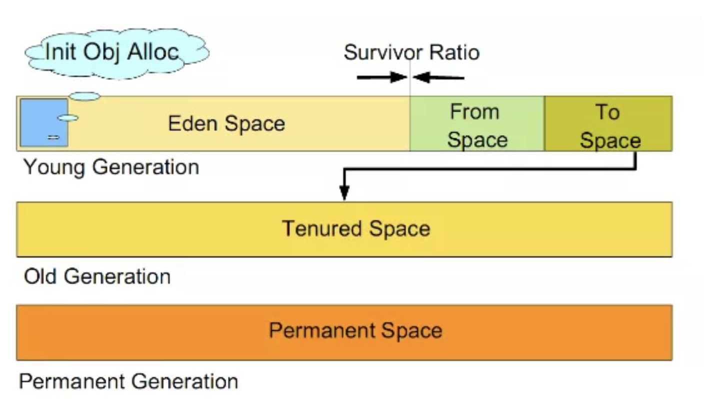
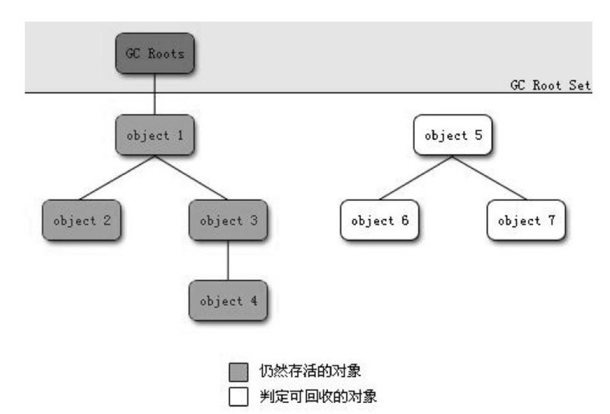

#### 先来说下，内存分区

​       内存主要被分为三块：**新生代（Youn Generation）、老年代（Old Generation）、永久代（Permanent Generation）**。三代的特点不同，造就了他们使用的GC算法不同，新生代适合生命周期较短，快速创建和销毁的对象，旧生代适合生命周期较长的对象，持久代在Sun Hotpot虚拟机中就是指方法区（有些JVM根本就没有持久代这一说法）。




#### 新生代

新生代由 Eden 与 Survivor Space（S0，S1）构成，大小通过-Xmn参数指定，Eden 与 Survivor Space 的内存大小比例默认为8:1，可以通过-XX:SurvivorRatio 参数指定，比如新生代为10M 时，Eden分配8M，S0和S1各分配1M。

**Eden** ：希腊语，意思为伊甸园，在圣经中，伊甸园含有乐园的意思，根据《旧约·创世纪》记载，上帝耶和华照自己的形像造了第一个男人亚当，再用亚当的一个肋骨创造了一个女人夏娃，并安置他们住在了伊甸园。

大多数情况下，对象在Eden中分配，当Eden没有足够空间时，会触发一次Minor GC，虚拟机提供了-XX:+PrintGCDetails参数，告诉虚拟机在发生垃圾回收时打印内存回收日志。

**Survivor** ：意思为幸存者，是新生代和老年代的缓冲区域。 当新生代发生GC（Minor GC）时，会将存活的对象移动到S0内存区域，并清空Eden区域，当再次发生Minor GC时，将Eden和S0中存活的对象移动到S1内存区域。

存活对象会反复在S0和S1之间移动，当对象从Eden移动到Survivor或者在Survivor之间移动时，对象的GC年龄自动累加，当GC年龄超过默认阈值15时，会将该对象移动到老年代，可以通过参数-XX:MaxTenuringThreshold 对GC年龄的阈值进行设置。

#### 老年代

老年代的空间大小即-Xmx 与-Xmn 两个参数之差，用于存放经过几次Minor GC之后依旧存活的对象。当老年代的空间不足时，会触发Major GC/Full GC，速度一般比Minor GC慢10倍以上。

#### 永久代

在JDK8之前的HotSpot实现中，类的元数据如方法数据、方法信息（字节码，栈和变量大小）、运行时常量池、已确定的符号引用和虚方法表等被保存在永久代中，32位默认永久代的大小为64M，64位默认为85M，可以通过参数-XX:MaxPermSize进行设置，一旦类的元数据超过了永久代大小，就会抛出OOM异常。

虚拟机团队在JDK8的HotSpot中，把永久代从Java堆中移除了，并把类的元数据直接保存在本地内存区域（堆外内存），称之为元空间。

这样做有什么好处？ 有经验的同学会发现，对永久代的调优过程非常困难，永久代的大小很难确定，其中涉及到太多因素，如类的总数、常量池大小和方法数量等，而且永久代的数据可能会随着每一次Full GC而发生移动。

而在JDK8中，类的元数据保存在本地内存中，元空间的最大可分配空间就是系统可用内存空间，可以避免永久代的内存溢出问题，不过需要监控内存的消耗情况，一旦发生内存泄漏，会占用大量的本地内存。

> JDK7之前的HotSpot，字符串常量池的字符串被存储在永久代中，因此可能导致一系列的性能问题和内存溢出错误。在JDK8中，字符串常量池中只保存字符串的引用。

#### GC机制

随着程序的运行，内存中的实例对象、变量等占据的内存越来越多，如果不及时进行回收，会降低程序运行效率，甚至引发系统异常。

​       在五个内存区域中，有3个是不需要进行垃圾回收的：本地方法栈、程序计数器、虚拟机栈。因为他们的生命周期是和线程同步的，随着线程的销毁，他们占用的内存会自动释放。所以，只有方法区和堆区需要进行垃圾回收，回收的对象就是那些不存在任何引用的对象。


#### 查找算法

1. 引用计数器

​        经典的**引用计数算法**，每个对象添加到引用计数器，每被引用一次，计数器+1，失去引用，计数器-1，当计数器在一段时间内为0时，即认为该对象可以被回收了。

> 引用计数法实现简单，判定高效，但不能解决对象之间相互引用的问题。


2. 根搜索算法




​		基本思想是：从一个叫GC Roots的根节点出发，向下搜索，如果一个对象不能达到GC Roots的时候，说明该对象不再被引用，可以被回收。如上图中的Object5、Object6、Object7，虽然它们三个依然相互引用，但是它们其实已经没有作用了，这样就解决了引用计数算法的缺陷。


判定一个对象objA是否可回收，至少要经历两次标记过程：

1. 如果对象objA到 GC Roots没有引用链，则进行第一次标记。 
2. 如果对象objA重写了finalize()方法，且还未执行过，那么objA会被插入到F-Queue队列中，由一个虚拟机自动创建的、低优先级的Finalizer线程触发其finalize()方法。finalize()方法是对象逃脱死亡的最后机会，GC会对队列中的对象进行第二次标记，如果objA在finalize()方法中与引用链上的任何一个对象建立联系，那么在第二次标记时，objA会被移出"即将回收"集合。


#### 代码实践

```java
public class FinalizerTest {
    public static FinalizerTest object;

    public void isAlive() {
        System.out.println("I'm alive");
    }

    @Override
    protected void finalize() throws Throwable {
        super.finalize();
        System.out.println("method finalize is running");
        object = this;
    }

    public static void main(String[] args) throws Exception {
        object = new FinalizerTest();

        // 第一次执行，finalize方法会自救
        object = null;
        System.gc();

        Thread.sleep(500);
        if (object != null) {
            object.isAlive();
        } else {
            System.out.println("I'm dead");
        }

        // 第二次执行，finalize方法已经执行过
        object = null;
        System.gc();

        Thread.sleep(500);
        if (object != null) {
            object.isAlive();
        } else {
            System.out.println("I'm dead");
        }
    }
}
```

执行结果：

```java
method finalize is running
I'm alive
I'm dead
```

从执行结果可以看出： 第一次发生GC时，finalize方法的确执行了，并且在被回收之前成功逃脱； 第二次发生GC时，由于finalize方法只会被JVM调用一次，object被回收。