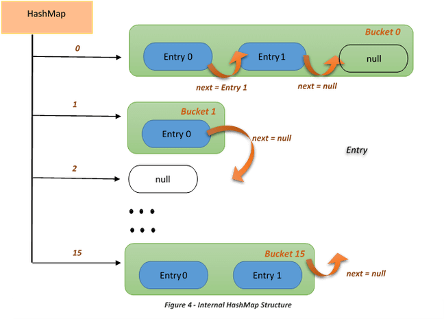
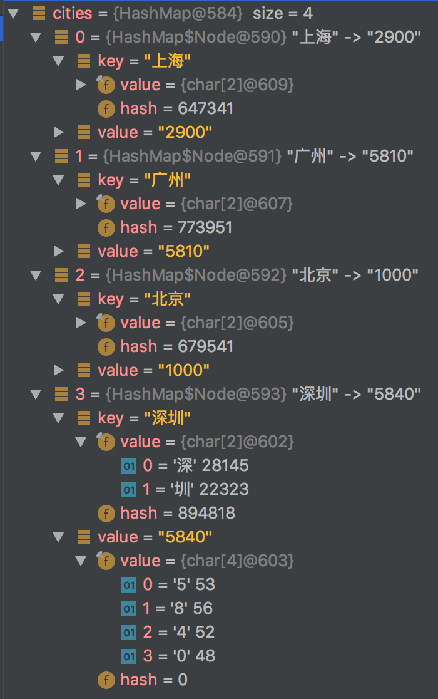

### HashMap内部是什么样的数据结构，底层是怎么实现的？


## 什么是哈希？

哈希是把一个值转化为另外一个值的一种机制，而转化方法通常叫做哈希函数，一般情况下哈希后会输出成一个int，这个int通常叫做Hash Code，另外的Hash Code也可能是hash串，这些hash串通常用于安全、排序。


### 哈希有什么用处？

如果在未排序数组中查找值，通常做法是做循环匹配查找，所以它的时间复杂度是O(n)，如果是排序过的数组，则时间复杂度是O(log n)，但是使用Hash算法可以把查找时间降到O(1)，Hash算法可以将给定的值生成一个Hash Code，可以使用Hash Code一次计算就能定位到Value。


那我们从名字上可以看出来HashMap的数据结构是基于哈希来实现的map<K,V>的，也就是经过key的哈希值计算得到value的地址。

我们先从官网上找答案：
[HashMap官方文档](https://docs.oracle.com/javase/8/docs/api/java/util/HashMap.html)

> Hash table based implementation of the Map interface. This implementation provides all of the optional map operations, and permits null values and the null key. (The HashMap class is roughly equivalent to Hashtable, except that it is unsynchronized and permits nulls.) This class makes no guarantees as to the order of the map; in particular, it does not guarantee that the order will remain constant over time.

> This implementation provides constant-time performance for the basic operations (get and put), assuming the hash function disperses the elements properly among the buckets. Iteration over collection views requires time proportional to the "capacity" of the HashMap instance (the number of buckets) plus its size (the number of key-value mappings). Thus, it's very important not to set the initial capacity too high (or the load factor too low) if iteration performance is important.


总结下来HashMap有几个特点：
* 基于Map的接口实现
* get，put操作达到了O(1)的性能
* 允许null的key、value
* 不保证有序，顺序也会发生变化（大家可以运行demo可以看到效果）

demo：
```java
import java.util.HashMap;

public class MapTest {
    public static void main(String[] args) {
        HashMap<String, String> cities = new HashMap<>();

        cities.put("北京", "1000");
        cities.put("上海", "2900");
        cities.put("广州", "5810");
        cities.put("深圳", "5840");

        System.out.println(cities);
    }
}
```
结果：
{上海=2900, 广州=5810, 北京=1000, 深圳=5840}


###  那在java的HashMap的底层数据结构到底是什么样的？

先看下hashmap的数据结构



HashMap默认会生成16个容量的数组，每个bucket使用linkedlist(不是java中的Linked-List)来保存数据节点，每个节点有指向下一个节点的指针。


还是回到刚才的demo，家看下cities的数据结构，可以很清楚的看到key="上海"的hash值是647341。也就是通过这个值在HashMap中快速的查找的




按照这样的数据结构实现会有两个问题

### 如果两个key有同样的hashcode怎么办？

在这里，java中每个key对象都有`equals()` 方法，hashcode来找到linkedlist后，每个节点使用`keys.equals()`直到 `equals()` 返回true，然后返回值就是我们要找的value。

### 如果HashMap空间不够用了怎么办？

还是回到官方文档，在创建HashMap时有默认的load factory(0.75)，当HashMap的容量达到这个上限（16 * 0.75 = 12），就会调整HashMap的容量为当前的2倍。